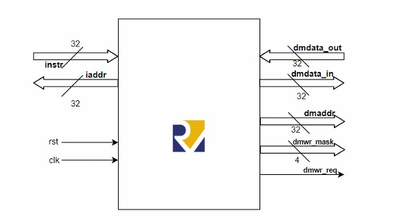

# Final Capstone Project
## STRV32I

### Problem Statement:
   Design a 3-stage pipelined RISC-V processor that works on RV32I ISA-STRV32I.

### Interface Details

1.General Interface:
a. clk_in: System clock (10Mhz).
b. rst_in: Active high and synchronous system reset.
2. Instruction Cache Interface:
a. imaddr_out: Carries 32-bit target address to icache.
b. instr_in: 32-bit instruction fetched from icache.
3. Data Cache Interface:
a. dmwr_req_out: Write request signal to dcache, when high indicates a write request to dcache while being low it indicates a read request. This is a single bit signal.
b. dmaddr_out: Carries the 32-bit target(read/write) address to dcache.
c. dmdata_in: This is the 32-bit data read from dcache. During the Load.
d. dmdata_out: This is the 32-bit data to be written to dcache. During the Store.
e. dmwr_mask_out: This is a 4-bit mask signal that decides the bits to be masked during the dcache write operation.

## Files

----->Top_module
----->PC_MUX
----->reg_block
----->immediate_adder
----->write_enable_generator
----->control_unit
----->immediate_generator
----->reg_file
----->instruction_mux
----->branch_unit
----->load_unit
----->store_unit
----->decoder_unit
----->ALU_block
----->reg_block2
----->wb_mux
----->processor_tb

## PC_MUX

● Decide next PC value.
● As here each memory location is of 32 bits so every time, under normal circumstances, PC get incremented by 4
● If any misalign instr. comes then for that we have misaligned_instr_out
● If reset then the value of PC becomes 0000H
● In the case of Branch or Jump instr. we have to jump at a new location, ( for which immediate value is offset to PC) for that we have i_addr_o.

## Reg_block1

 ● It is used for synchronization purpose so that all the signals of stage 1 pass through it so that they are able to reach 2nd stage in 2nd clock cycle

## imm_adder 

● It takes the PC_in and adds it with the immediate value produced by immediate generator and hence successfully generates new value of PC

## wr_en_generator 

● It generates the write enable signals, which will decide whether we can access the register file for writing / updating any value

## imm_generator
* In case of instruction of branch and jump type, we need to make a immediate value which will be later added to pc so that immediate value will be produced by immediate generator.

## RISC-V Architecture

## Simulation Waveform

